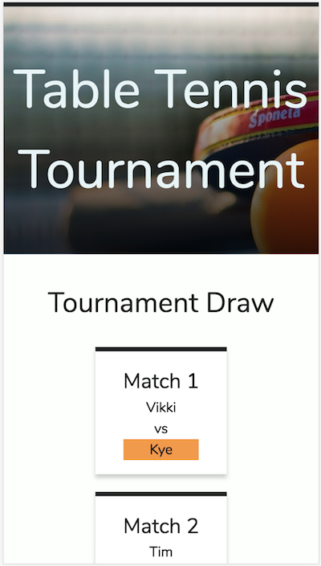

# Table Tennis Tournament Random Draw Generator

A website which accepts table tennis player names and generates a random tournament draw.  Subsequent rounds are generated once winners have been selected.

## Description

The user is able to enter two or more players, and the tool will generate a random tournament draw from the players entered.  Once the first round is created, users can select the winner of each match and the next round will be generated, again with random pairings.  

Odd numbers of players are handled by randomly assigning one player a bye through to the next round.  Once there are only two players left in the tournament the final matchup is displayed.

---

## Installation instructions

This project is built using JavaScript, HTML, and Sass, to make installation as simple as possible.  You can see it working here:

http://deanna.developme.space/table-tennis-tournament/index.html 

To get a development version working on your local machine, pull down the code from this repository.  

You will need Sass to change the css.  If you do not have Sass installed, instructions to do this can be found here:

https://sass-lang.com/install

Once you have Sass installed, you can run the sass executable to compile .scss files to .css files by changing to the css directory and running the following on the command line:

`sass --watch application.scss:styles.css`

---

## Testing

The project has been tested for valid HTML, CSS, and accessibility using the tools below:
* https://validator.w3.org/
* https://jigsaw.w3.org/css-validator/
* https://wave.webaim.org/

It has also been tested in the latest versions of Chrome, Safari and Firefox as of 6 April 2018, as well as on mobile emulators and a Samsung Galaxy S5 phone.  Please report any cross-browser issues to the author.

### Mobile view

---

## Author

Deanna Marbeck

---
